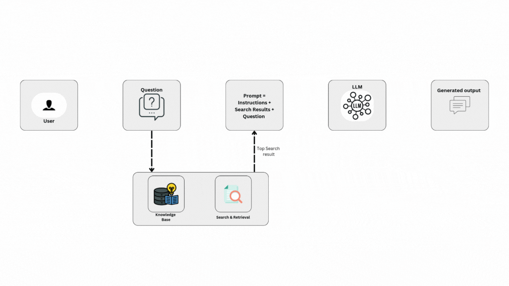

<h2 align="center">RAG (Retrieval-Augmented Generation) </h2>

Retrieval-Augmented Generation (RAG) is an AI technique where a language model first retrieves relevant information from a knowledge source (like a database, documents, or vector store) and then uses that information to generate more accurate and reliable answers.

<h3>RAG Architecture</h3>

### Important Keywords & Meaning
1. Document - Stores a piece of text you want the AI to learn from.
2. Embeddings - Converts text into numbers (vectors) so the computer can compare meaning. Embeddings are the translator between text and math.
3. FAISS(Facebook AI Similarity Search) - A fast database for storing and searching embeddings.
4. Retriever - Looks inside FAISS and finds the most relevant documents when you ask a question.
5. RetrievalQA - Combines the Retriever + LLM. RetrievalQA is the full pipeline: Search → Read → Answer.
   - Steps:
       1. You ask a question.
       2. Retriever finds the most relevant docs.
       3. LLM reads those docs and gives a final answer.
6. invoke - Runs the pipeline with your query. like pressing the start button.
7. result - The final answer from the LLM. This is the AI’s spoken answer.